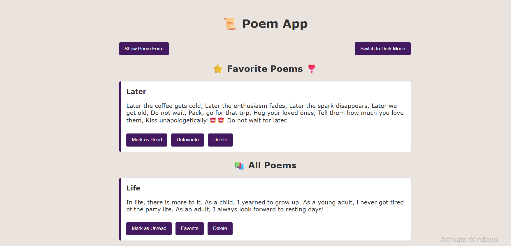
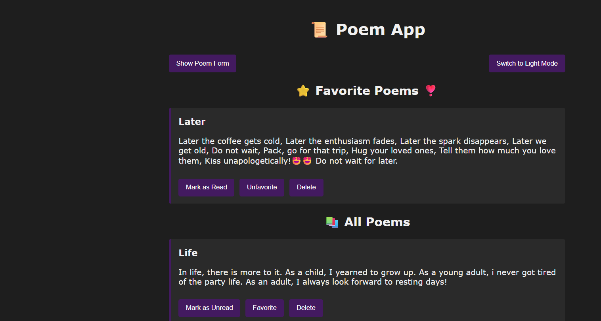

📜 Poem App

A lightweight React app for creating, reading, favoriting, and managing your favorite poems — with support for dark mode, animations, and local persistence using localStorage.

    🚀 Features

    ✅ Core Functionality

. View all created poems.

. Toggle visibility of the poem creation form.

. Create new poems with a title and content.

. Mark poems as read/unread.

    🌟 Advanced Features

. Mark poems as favorites and view them in a separate list.

. Delete poems permanently (with persistence).

. Theme toggle: Light & Dark modes with smooth transitions.

. Simple animations for form toggle, card entry, and button hover.

. Poem data is persisted using local Storage.

📁 Project Structure
vite-poem-app/
├── index.html
├── vite.config.js
├── package.json
├── src/
│ ├── main.jsx
│ ├── App.jsx
│ ├── index.css
│ └── components/
│ ├── PoemForm.jsx
│ ├── PoemList.jsx
│ └── PoemItem.jsx

🛠 Tech Stack
.React

.Vite

.HTML + CSS

.JavaScript

🧪 Installation & Running Locally
💡 Requires Node.js (>= 16)

1. Clone the repository
   --> git clone 'git@github.com:Moringa-SDF-PT10/poesy-FELISTUS-KIMANTHI.git'
   cd vite-poesy-FELISTUS-KIMANTHI
2. Install dependencies
   --> npm install
3. Start the development server
   --> npm run dev
4. Open in your browser
   --> http://localhost:5173

| Light Mode                             | Dark Mode                                    |
| -------------------------------------- | -------------------------------------------- |
| ! | ](#) |

💡 Future Improvements
. Add user authentication (e.g. Firebase or Supabase)

. Enable cloud sync of poems

. Add poem categories/tags

. Export poems as .txt or .pdf

📝 License
MIT License.
Feel free to use, fork, and modify.

Author
Built with ❤️ by Felistus Kimanthi
